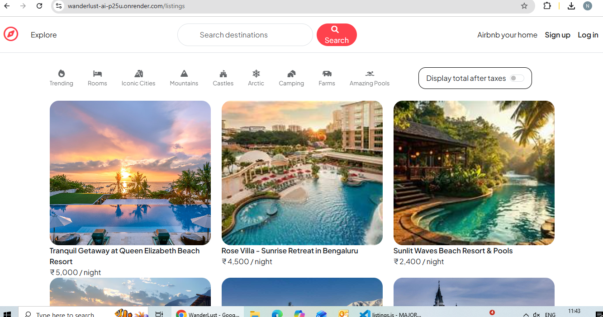
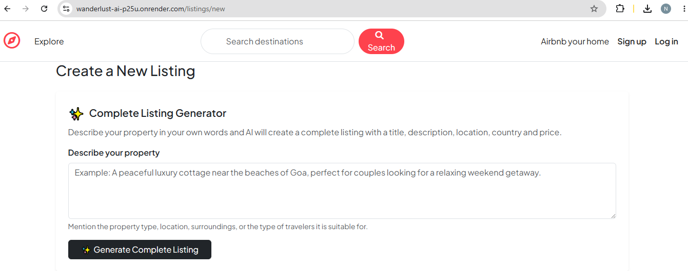
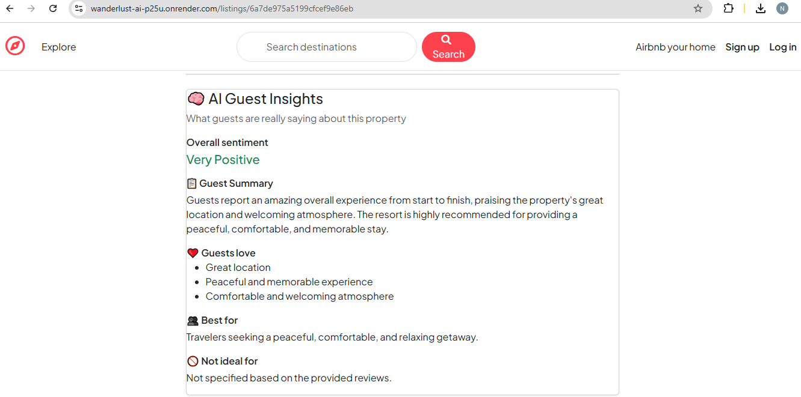
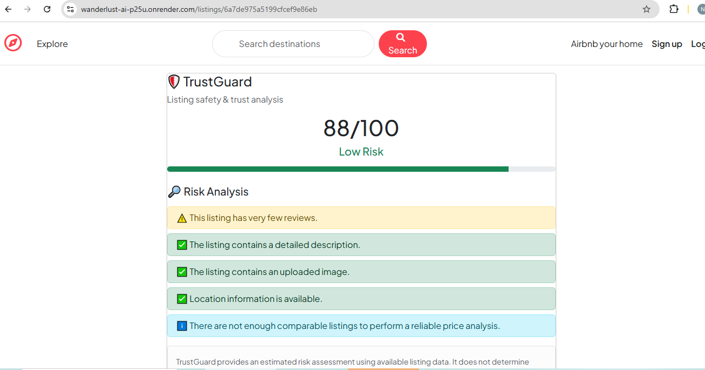

# Wanderlust-AI

> An AI-powered travel and property discovery platform built with Node.js, Express, MongoDB, EJS, and modern web technologies.

**Live Demo:** https://wanderlust-ai-p25u.onrender.com/listings  
**GitHub:** https://github.com/maryam734/wanderlust-ai

---
## **Screenshots**

### Wanderlust Listings



### Listing Creation



### Listing Reviews



### TrustGuard



---

## Overview

**Wanderlust-AI** is a full-stack travel and property discovery platform inspired by modern accommodation marketplaces.

The project began as a traditional listing-based web application and was extended with **AI-powered functionality, intelligent category discovery, trust scoring, geolocation, authentication, reviews, and cloud deployment**.

The goal was to build more than a basic CRUD application by combining a complete full-stack architecture with practical AI-driven features that improve both property creation and travel discovery.

---

## Key Features

### AI-Powered Listing Generation

Users can generate property listing content using the **Google Gemini API**.

The AI-assisted workflow generates attractive property descriptions from basic property information, reducing the effort required to manually create listings.

**Highlights:**

- Google Gemini API integration
- Prompt-based content generation
- Dynamic integration with the listing creation workflow
- Server-side API handling

---

### Smart Category-Based Discovery

Wanderlust-AI provides category-based discovery for different types of travel experiences.

**Available Categories:**

- Trending
- Rooms
- Iconic Cities
- Mountains
- Castles
- Arctic
- Camping
- Farms
- Amazing Pools

The application dynamically filters listings based on category-related keywords stored in the listing data.

---

### Trust Score

The platform includes a **Trust Score** feature that provides users with an additional layer of information when evaluating listings.

A dedicated `trustGuard` utility calculates the trust result for a listing and exposes it through a backend API endpoint.

This extends the traditional property-listing model with an additional trust and verification layer.

---

### Geolocation

Listings can be associated with geographic coordinates based on their location and country.

The application uses **OpenStreetMap Nominatim** for geocoding when coordinates are unavailable.

This allows listings to be progressively enriched with geographic data without requiring coordinates to be entered manually.

---

### Authentication and Authorization

The application includes user authentication and authorization to protect listing-related operations.

Authenticated users can manage listings, while access-controlled routes help prevent unauthorized modifications.

---

### Listing Management

The platform supports the complete listing lifecycle:

- Create listings
- View listings
- Update listings
- Delete listings
- Upload listing images
- View detailed property information

---

### Reviews

Users can interact with listings through a review system.

The application supports:

- Adding reviews
- Displaying reviews
- Associating reviews with users
- Removing reviews where authorized

Reviews are populated from MongoDB and displayed dynamically on listing pages.

---

### Cloud Image Storage

Listing images are uploaded and stored using cloud-based image handling rather than relying only on local files.

This makes the application more suitable for production deployment.

---

### Production Deployment

The application is deployed publicly using:

- **Render** — application hosting
- **MongoDB Atlas** — cloud database
- **GitHub** — source control and deployment workflow

This provides a complete development-to-production workflow.

---

# Tech Stack

## Frontend

- HTML5
- CSS3
- JavaScript
- EJS
- Bootstrap

## Backend

- Node.js
- Express.js

## Database

- MongoDB
- Mongoose
- MongoDB Atlas

## AI

- Google Gemini API

## APIs and Services

- OpenStreetMap Nominatim — geocoding
- Cloudinary — image storage
- Render — deployment

## Authentication and Middleware

- Express Session
- Passport.js
- Connect-Mongo
- Method Override
- EJS-Mate

## Development Tools

- Git
- GitHub
- npm
- VS Code

---

# Project Architecture

The application follows a modular **MVC-style architecture**.

```text
wanderlust-ai/
│
├── controllers/
│   ├── listings.js
│   ├── reviews.js
│   └── users.js
│
├── models/
│   ├── listing.js
│   ├── review.js
│   └── user.js
│
├── routes/
│   ├── listing.js
│   ├── review.js
│   ├── user.js
│   └── ai.js
│
├── utils/
│   ├── trustGuard.js
│   └── ExpressError.js
│
├── views/
│   ├── listings/
│   ├── users/
│   ├── layouts/
│   └── includes/
│
├── public/
│   ├── css/
│   └── js/
│
├── init/
│   └── data.js
│
├── app.js
├── package.json
└── README.md
```

## Request Flow

```text
User
  │
  ▼
EJS / Browser
  │
  ▼
Express Routes
  │
  ▼
Controllers
  │
  ├──────────────► Gemini API
  │
  ├──────────────► Nominatim API
  │
  ▼
Mongoose Models
  │
  ▼
MongoDB Atlas
```

## AI Architecture

The AI feature follows a server-side architecture:

```text
User Input
    │
    ▼
Listing Creation Interface
    │
    ▼
Express AI Route
    │
    ▼
Google Gemini API
    │
    ▼
Generated Listing Content
    │
    ▼
Frontend
```

The API key is kept server-side through environment variables instead of exposing credentials in the frontend.

---

## Environment Variables

Create a `.env` file in the project root:

```env
ATLASDB_URL=your_mongodb_atlas_connection_string
SECRET=your_session_secret
GEMINI_API_KEY=your_gemini_api_key
CLOUDINARY_CLOUD_NAME=your_cloudinary_cloud_name
CLOUDINARY_KEY=your_cloudinary_key
CLOUDINARY_SECRET=your_cloudinary_secret
```

---

# Installation and Setup

## 1. Clone the Repository

```bash
git clone https://github.com/maryam734/wanderlust-ai.git
cd wanderlust-ai
```

## 2. Install Dependencies

```bash
npm install
```

## 3. Configure Environment Variables

Create a `.env` file and add the required credentials.

## 4. Start the Application

For development:

```bash
npm start
```

The application will be available at:

```text
http://localhost:8080
```

---

# Database

The project uses **MongoDB Atlas** for production data storage.

The main database entities are:

```text
User
  │
  ├── owns ───────► Listings
  │
  └── writes ─────► Reviews

Listing
  │
  └── has ────────► Reviews
```

Mongoose is used for:

- Schema definition
- Validation
- Population
- Database interaction

---

# Important Backend Features

## Dynamic Category Filtering

The listings controller supports category-based filtering through query parameters.

Example:

```text
/listings?category=Camping
```

The backend maps the category to relevant keywords and queries MongoDB dynamically.

---

## Trending Discovery

Trending listings are presented as a curated subset of available listings, allowing the category to remain populated even when listing titles do not explicitly contain the word `"trending"`.

---

## Geocoding

When a listing does not contain geographic coordinates, the backend attempts to obtain them using:

**OpenStreetMap Nominatim**

Coordinates are stored with the listing using GeoJSON-style data.

---

## Trust Score API

A dedicated endpoint calculates trust information for an individual listing:

```http
GET /listings/:id/trust-score
```

The calculation is handled through the `trustGuard` utility.

---

# Problems Solved

Wanderlust-AI was designed to address several limitations of a traditional property listing application.

### Traditional Listing Platforms

Creating high-quality property descriptions manually can be time-consuming.

**Wanderlust-AI Solution:**  
AI-assisted listing generation helps automate content creation.

---

### Traditional CRUD Applications

Users often have limited ways to discover listings beyond basic browsing.

**Wanderlust-AI Solution:**  
Category-based discovery provides multiple travel-oriented exploration paths.

---

### Traditional Listing Systems

Users may have difficulty judging the credibility or quality of a listing.

**Wanderlust-AI Solution:**  
A dedicated Trust Score layer provides additional listing-level information.

---

### Traditional Applications

Location information may remain basic text data.

**Wanderlust-AI Solution:**  
Geocoding enriches listings with geographic coordinates.

---

# Testing

The application was tested through:

- Manual browser testing
- CRUD operation testing
- Authentication flow testing
- Category filtering testing
- AI feature testing
- Image upload testing
- Deployment testing
- MongoDB Atlas connectivity testing

---

# Security Considerations

The project follows several basic security practices:

- Environment variables for secrets
- Server-side API key handling
- Session-based authentication
- Authorization checks for protected operations
- MongoDB-backed session storage
- Input validation through Mongoose schemas

---

# Deployment

The production system uses:

```text
GitHub
   │
   ▼
Render
   │
   ├── Node.js / Express Application
   │
   ▼
MongoDB Atlas
```

Every change pushed to the `main` branch can be deployed through the connected Render service.

---

# What I Learned

Building Wanderlust-AI helped me strengthen my understanding of:

- Full-stack application architecture
- RESTful routing
- MVC design
- MongoDB data modeling
- Mongoose relationships and population
- Authentication and authorization
- Session management
- Cloud image handling
- Third-party API integration
- Prompt-based AI integration
- Geocoding APIs
- Production deployment
- Environment variable management
- Debugging deployment issues
- Git and GitHub workflows

---

# Future Improvements

Possible future extensions include:

- Advanced semantic / natural-language search
- Personalized travel recommendations
- Wishlist / favorites
- Booking and reservation management
- AI-generated travel itineraries
- Map-based property exploration
- More sophisticated ranking and recommendation models
- Automated listing moderation
- Real-time notifications

---

# Why This Project?

Wanderlust-AI was built to explore how a conventional full-stack marketplace can be extended with AI and intelligent discovery features.

Rather than stopping at CRUD functionality, the project focuses on integrating:

> **Full-Stack Development + AI + Data + APIs + Deployment**

into one production-style application.

---

# Author

## Maryam Naim

**B.Tech — Computer Science & Engineering**
